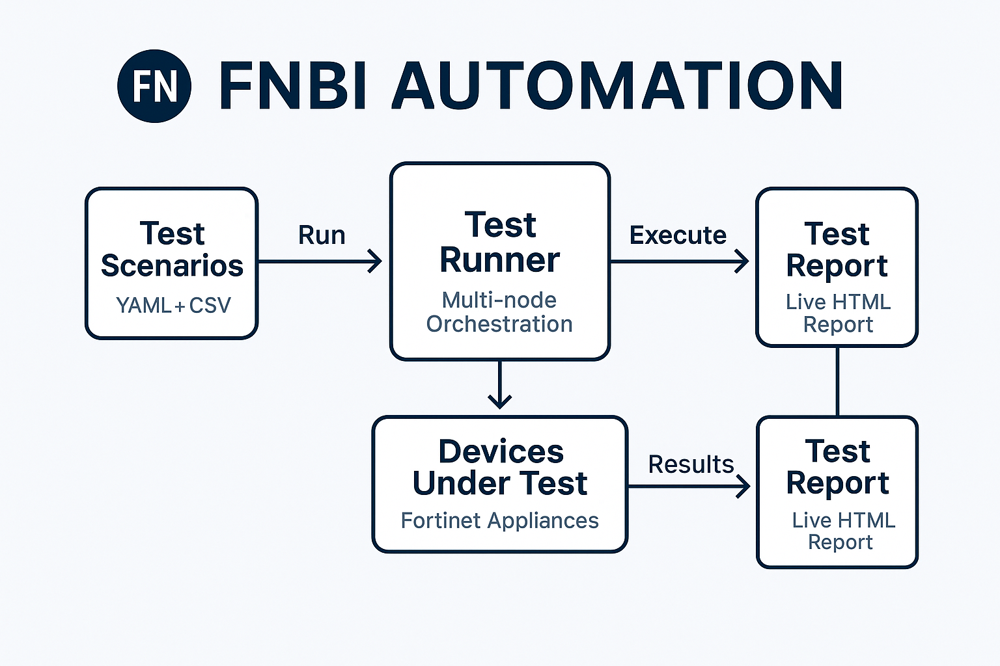

# FortiNBI Automated Testing


FNBI automation test suite. Follow this quick start to run a demo suite in minutes.

## 🚀 Quick Start – FNBI Automation

Clone, setup, run a demo suite in 3 minutes. [Jump to configuration](#configuration).
```bash
git clone https://github.com/yourusername/fnbi-automated-testing.git
cd fnbi-automated-testing
python -m venv venv
source venv/bin/activate
pip install -r requirements.txt
cp config/config.yaml.example config/config.yaml
python mocks/simple_http_server.py &
pytest -v
```

<!-- upload an image to docs/flowchart.png if you want to display the flowchart -->
## Project Structure

The repository is organised into the following top-level directories:

- `src/` – Core helper modules such as `BrowserControl`, `FNBIApp` and `FNBIService`
- `fnbi_tests/` – Automated test suites grouped by feature area
- `tests/` – Unit tests for the helper modules
- `config/` – YAML configuration files
- `resources/` – Baseline images and other static assets
- `mocks/` – Mock web pages and a simple HTTP server used during testing
- `scripts/` – Helper scripts for running and managing tests
- `docs/` – Additional project documentation
- `test_scenarios/` and `testcases/` – YAML files describing manual and automated scenarios

## Setup

1. Clone the repository
2. Create a virtual environment: `python -m venv venv`
3. Activate the virtual environment:
   - Windows: `venv\Scripts\activate`
   - Unix or MacOS: `source venv/bin/activate`
4. Install dependencies: `pip install -r requirements.txt`

5. Copy `config/config.yaml.example` to `config/config.yaml` and edit the paths for your environment
6. Set the `TEST_RUNNER_PASSWORD` environment variable to override the default `CHANGEME` password used in `test_runner.py`


## Running Tests

Start the mock HTTP server before executing the tests:

```bash
python mocks/simple_http_server.py &
```

To run all tests:

```
pytest fnbi_tests
```

To run tests for a specific module:

```
pytest fnbi_tests/extension
```

## Configuration

Copy `config/config.yaml.example` to `config/config.yaml` and edit paths for your environment. Set the `TEST_RUNNER_PASSWORD` variable if you need to override the default.

## Documentation

- For installation instructions, see [docs/installation.md](docs/installation.md)
- For usage guidelines, see [docs/usage.md](docs/usage.md)
- For architecture details, see [docs/architecture.md](docs/architecture.md)

## Contributing

Please read CONTRIBUTING.md for details on our code of conduct and the process for submitting pull requests.

## License

This project is licensed under the MIT License - see the [LICENSE](LICENSE) file for details.
